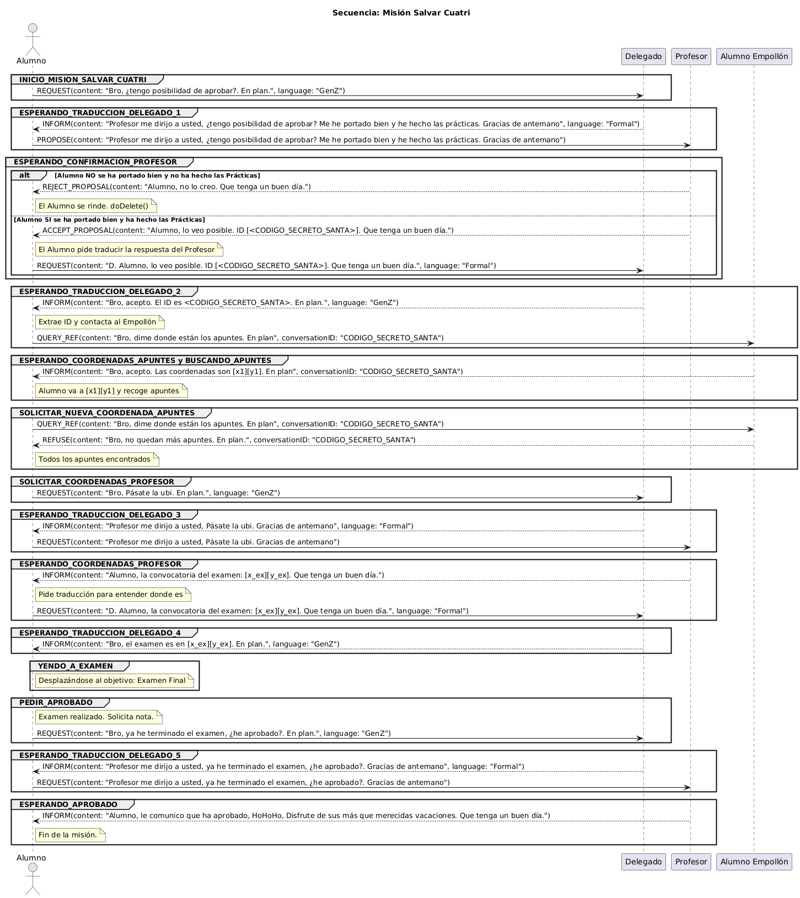

# 🎓 Diseño Basado en Agentes: Práctica 3 (Comunicación)

> **"Operación: Salvar el Cuatrimestre"** — Una simulación de Sistema Multi-Agente (SMA) usando Java JADE donde un alumno lucha contra las probabilidades para aprobar la asignatura.

---

## 📖 Introducción

Este proyecto simula una interacción compleja entre agentes inteligentes en un entorno académico. El escenario es conocido: un **Alumno Promedio** que no ha asistido a clase en todo el cuatrimestre intenta salvar la asignatura en el último momento.

Para lograrlo, debe negociar con el **Profesor**, obtener ayuda del **Delegado** (para traducir su jerga a un lenguaje formal), y buscar los apuntes que posee el **Alumno Empollón** (Rudolph).

### 🎄 Temática Navideña
Aunque la lógica modela un escenario universitario, los agentes utilizan internamente alias navideños para la lógica del código, tal como se explica en la documentación:

* **Alumno** (El Protagonista) -> *Agente*
* **Profesor** (La Autoridad) -> *Santa*
* **Delegado** (El Traductor) -> *Elfo*
* **Alumno Empollón** (El Poseedor de Apuntes) -> *Rudolph*
* **Apuntes** (El Objetivo) -> *Renos Perdidos*

---

## 🤖 Agentes y Roles

El sistema consta de 4 tipos de agentes principales que interactúan a través de protocolos de comunicación específicos.

| Agente (Rol) | Alias Temático | Descripción |
| :--- | :--- | :--- |
| **Delegado** | 🧝 *Elfo* | Actúa como traductor intermediario. Traduce la "jerga de la Generación Z" del Alumno a Castellano Formal para el Profesor, y viceversa. |
| **Alumno Empollón** | 🦌 *Rudolph* | Posee el "Santo Grial" de los apuntes. Una vez autorizado por el Profesor (mediante ID de conversación), guía al Alumno a las coordenadas de los apuntes. |
| **Profesor** | 🎅 *Santa* | La autoridad. Decide si el Alumno merece una oportunidad. Proporciona la ubicación del examen y la nota final. |
| **Alumno** | 🧑‍🎓 *Agente* | El actor principal. Debe coordinarse con todos los demás agentes para recolectar apuntes, encontrar el examen y solicitar el aprobado. |

---

## 📡 Protocolo de Comunicación

Los agentes se comunican utilizando **Mensajes ACL** (cumpliendo el estándar FIPA). El flujo de trabajo está estrictamente definido por una Máquina de Estados Finitos.

### Resumen del Flujo
1.  **Negociación:** El Alumno pide al **Delegado** que traduzca una solicitud para el **Profesor**.
2.  **Autorización:** Si el Profesor acepta la propuesta (`ACCEPT_PROPOSAL`), proporciona un ID para contactar al **Alumno Empollón**.
3.  **La Búsqueda:** El Alumno solicita coordenadas de los apuntes al **Empollón** (`QUERY_REF`) hasta encontrarlos todos.
4.  **El Examen:** Una vez estudiado, el Alumno pregunta al **Profesor** (vía traducción del Delegado) por la ubicación del examen.
5.  **Calificación:** Tras llegar al examen, el Alumno solicita la nota y recibe el aprobado final.

### Diagrama de Secuencia

## 🤝 Contribuidores

* **Raúl Florentino Serra**
* **Jesús Pereira Sánchez**
* **Juan Manuel Guerrero Espigares**

Proyecto realizado para la asignatura **Diseño Basado en Agentes** del **Grado en Ingeniería Informática** de la Universidad de Granada (UGR).